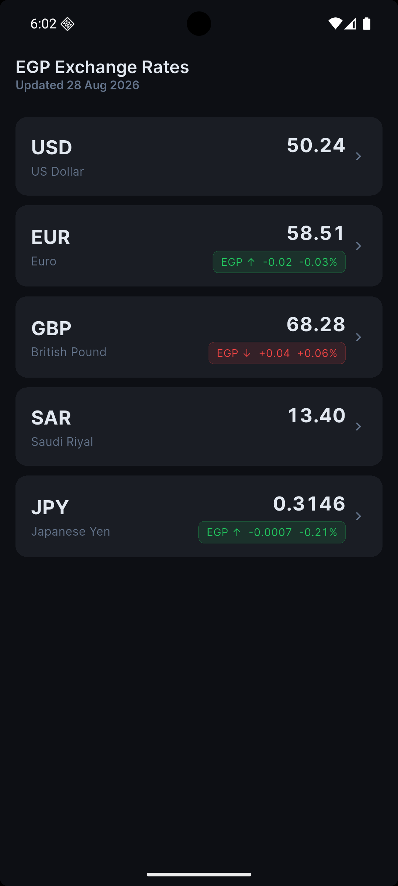
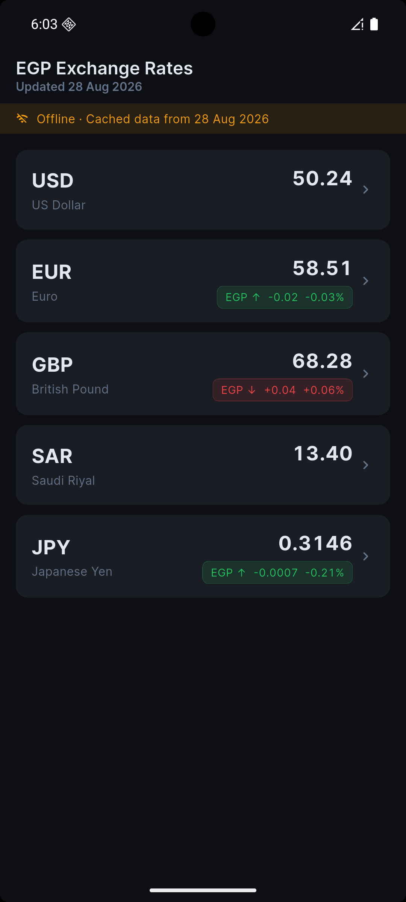
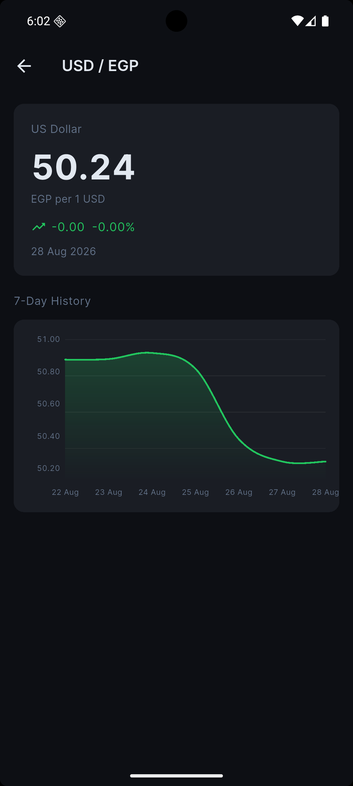
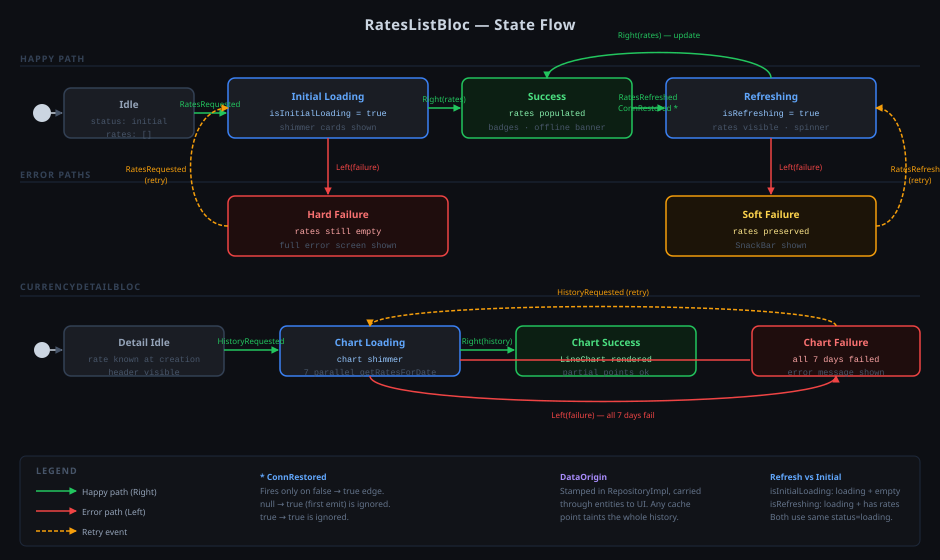

# axis_task

A Flutter currency exchange tracker displaying live EGP exchange rates against 5 major currencies.

## Screenshot






> Dark theme · Offline mode shows amber banner with cached data date · EGP trend badges (green = EGP strengthened, red = EGP weakened)

## Features

- **Live rates** — EGP vs USD, EUR, GBP, SAR, JPY from [currency-api](https://currency-api.pages.dev)
- **24h change** — absolute delta and percentage with directional context (`EGP ↑` / `EGP ↓`)
- **Offline support** — rates cached per date; amber banner shown when serving cached data
- **7-day history chart** — line chart with gradient fill on the detail screen
- **Auto-refresh** — refetches automatically when network is restored
- **Shimmer loading** — placeholder cards during initial fetch

## Architecture

```
lib/
├── core/           # errors, network, DI, theme, constants
└── features/
    └── currency/
        ├── data/       # models, datasources, repository impl
        ├── domain/     # entities, repository contract, use cases
        └── presentation/
            ├── bloc/   # RatesListBloc, CurrencyDetailBloc
            └── pages/  # RatesListPage, CurrencyDetailPage
```

## Diagrams

Visual references for the architecture and runtime behavior. Sources live under [`docs/`](docs/).

### Project Structure

High-level map of the feature-based layout — `core/`, `features/`, and the clean-architecture layers within each.


---

### State Flow

End-to-end BLoC state transitions: initial load → success → refresh → error and retry paths. Covers both `RatesListBloc` (main screen) and `CurrencyDetailBloc` (history chart screen).



---

## Tech Stack

| Concern | Package |
|---|---|
| State management | flutter_bloc |
| DI | get_it |
| Functional errors | dartz |
| Networking | http |
| Local cache | shared_preferences |
| Connectivity | connectivity_plus |
| Chart | fl_chart |
| Fonts | google_fonts |
| Loading | shimmer |

## Getting Started

```bash
flutter pub get
flutter run
```

Requires Flutter 3.x / Dart 3.x. No API key needed.

## Tests

```bash
flutter test
```

27 tests covering use case logic, repository fallback behaviour, model parsing, and BLoC state transitions.
