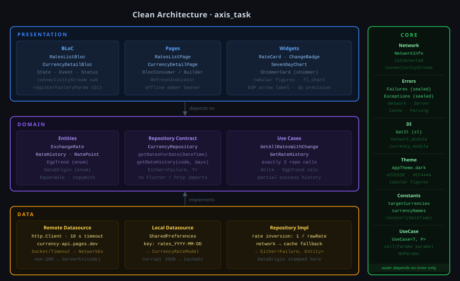
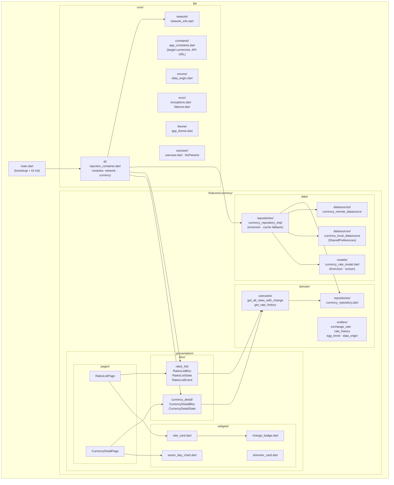

# Project Structure

High-level map of the feature-based layout. Every named box is a Dart file or directory that exists in `lib/`.

### Layer responsibilities

| Layer | Responsibility | Key rule |
|---|---|---|
| **domain** | Entities + use-case contracts | No Flutter, no http, no SharedPreferences |
| **data** | HTTP, cache, rate inversion | Returns `Either<Failure, T>`; never throws past the boundary |
| **presentation** | BLoC + widgets | Only calls use cases; never touches `http` or `SharedPreferences` directly |
| **core** | Shared primitives | No feature-specific logic |
