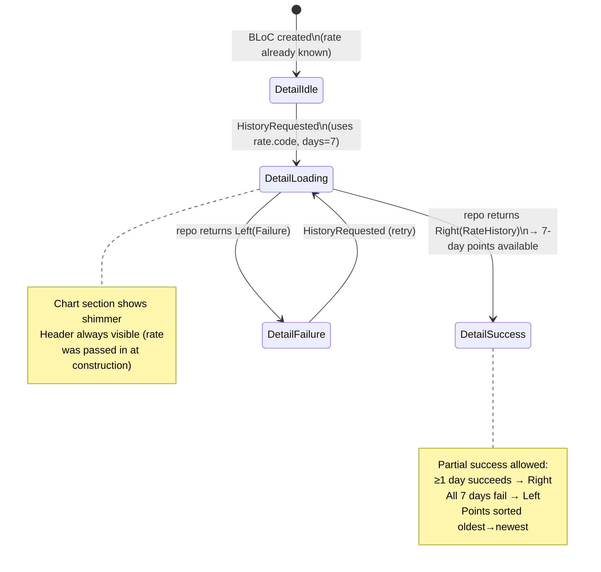

# State Flow

End-to-end BLoC state transitions for both blocs, including error and retry paths.


---

## RatesListBloc

Drives the main rates list screen. Handles initial load, manual refresh, and connectivity-triggered auto-refresh.

```mermaid
stateDiagram-v2
    [*] --> Idle : BLoC created\n(subscribes to connectivityStream)

    Idle --> InitialLoading : RatesRequested\n(rates = [])

    InitialLoading --> Success : use case returns Right\n→ rates populated
    InitialLoading --> HardFailure : use case returns Left\n→ rates still empty

    HardFailure --> InitialLoading : RatesRequested (retry)

    Success --> Refreshing : RatesRefreshed\nor ConnectivityRestored\n(rates preserved — list stays visible)

    Refreshing --> Success : use case returns Right\n→ rates updated
    Refreshing --> SoftFailure : use case returns Left\n→ rates preserved\n→ SnackBar shown

    SoftFailure --> Refreshing : RatesRefreshed (retry)

    note right of Refreshing
        isRefreshing = true
        (status=loading, rates non-empty)
        RefreshIndicator spinner active
    end note

    note right of InitialLoading
        isInitialLoading = true
        (status=loading, rates empty)
        Shimmer cards shown
    end note

    note right of ConnectivityRestored
        Only fires on false→true edge.
        null→true (first emit) is ignored.
        true→true is ignored.
    end note
```

### State shape

```
RatesListState {
  status   : initial | loading | success | failure
  rates    : List<ExchangeRate>      // empty until first success
  failure  : Failure?                // set on failure, cleared on next load
}

Derived booleans (used by UI):
  isInitialLoading = status==loading && rates.isEmpty
  isRefreshing     = status==loading && rates.isNotEmpty
```

### Event → handler summary

| Event | Guard | Action |
|---|---|---|
| `RatesRequested` | — | Fetches today + yesterday via `GetAllRatesWithChange` |
| `RatesRefreshed` | — | Same fetch; preserves current rates during loading |
| `ConnectivityRestored` | previous==false | Triggers `RatesRefreshed` internally |
| *(connectivity stream)* | isConnected && prev==false | Adds `ConnectivityRestored` |

---

## CurrencyDetailBloc

Drives the detail screen for a single currency. Receives the `ExchangeRate` at construction time (injected via `get_it` `registerFactoryParam`).



### Partial-success rule for history

`getRateHistory` fans out 7 parallel `getRatesForDate` calls. Individual day failures are silently dropped. The result is `Right` as long as at least one day succeeded; `Left` only when every day failed.

```
7 days requested
  ├─ 5 succeed, 2 fail → Right(5 points), sorted ascending by date
  └─ 0 succeed          → Left(Failure from last failed call)
```

### DataOrigin propagation

| Scenario | `RateHistory.dataOrigin` |
|---|---|
| All 7 points from network | `DataOrigin.network` |
| Any point from cache | `DataOrigin.cache` |
| Offline (all from cache) | `DataOrigin.cache` |

Most-conservative rule: one cache point taints the whole history.
